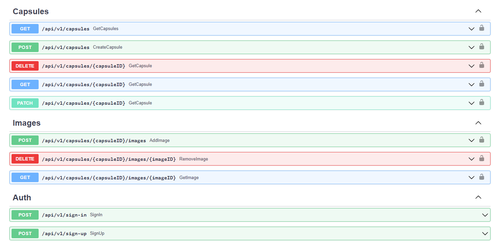

# TimeCapsule - Golang Application 🕰️

## Getting Started 🚀

### 📥 Clone the Repository

```shell
git clone github.com/rtsoy/time-capsule.git
```

### ⚙️ Configure Environment Variables

- Copy the contents of .env.example.
- Create a new file named .env in the root directory of the cloned repository.
- Paste the copied contents into the .env file.
- Edit the values in the .env file to match your desired configuration.

### 🐳 Run with Docker Compose

```shell
make run
```

## Accessing Documentation 📚

**📋 The documentation for the application is provided using Swagger UI.
Once the application is up and running, you can access the Swagger
documentation by opening your web browser and navigating to:**


>  [http://localhost:8080/swagger/](http://localhost:8080/swagger/)



## Contributing 🤝

**👨‍💻 If you would like to contribute to this project,
feel free to submit a pull request.**
